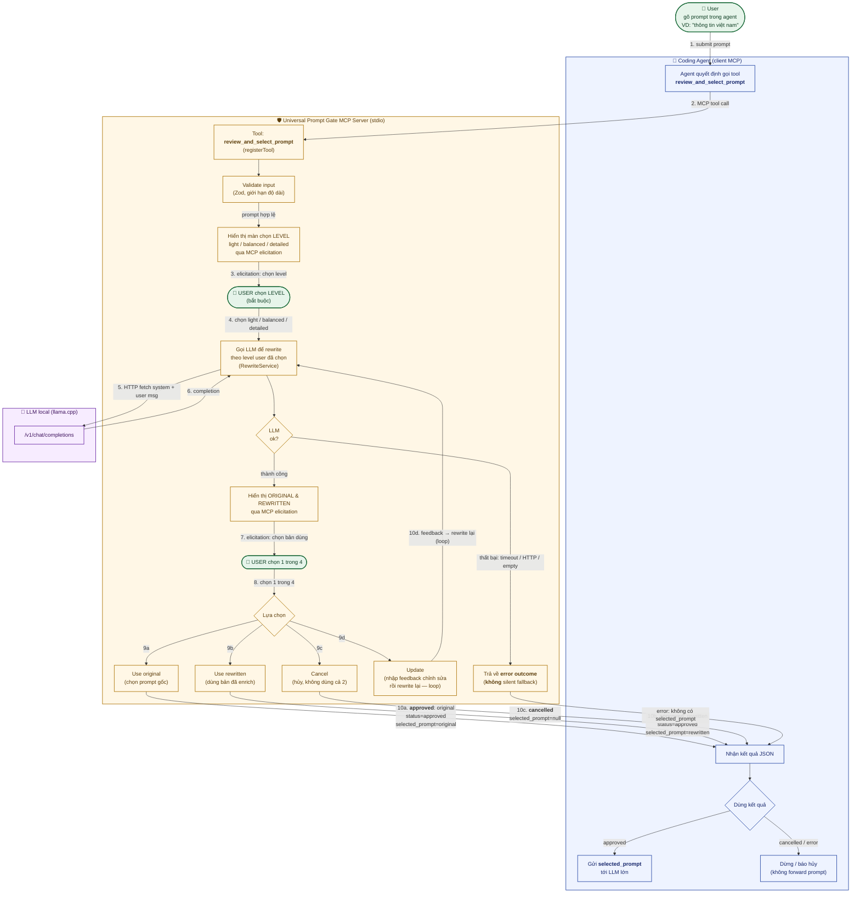

# Universal Prompt Gate — Workflow

Sơ đồ workflow tổng thể (Mermaid).

```mermaid
flowchart TD
  U(["👤 User<br/>gõ prompt trong agent<br/>VD: &quot;thông tin việt nam&quot;"]):::user

  subgraph AGENT["🤖 Coding Agent (client MCP)"]
    A1["Agent quyết định gọi tool<br/><b>review_and_select_prompt</b>"]:::agent
    A3["Nhận kết quả JSON"]:::agent
    A4{"Dùng kết quả"}:::agent
    AOK["Gửi <b>selected_prompt</b><br/>tới LLM lớn"]:::agent
    ASTOP["Dừng / báo hủy<br/>(không forward prompt)"]:::agent
  end

  subgraph MCP["🛡️ Universal Prompt Gate MCP Server (stdio)"]
    T["Tool: <b>review_and_select_prompt</b><br/>(registerTool)"]:::mcp
    V["Validate input<br/>(Zod, giới hạn độ dài)"]:::mcp
    LPE["Hiển thị màn chọn LEVEL<br/>light / balanced / detailed<br/>qua MCP elicitation"]:::mcp
    R["Gọi LLM để rewrite<br/>theo level user đã chọn<br/>(RewriteService)"]:::mcp
    RM{"LLM<br/>ok?"}:::mcp
    RE["Trả về <b>error outcome</b><br/>(<b>không</b> silent fallback)"]:::mcp
    E["Hiển thị ORIGINAL &amp; REWRITTEN<br/>qua MCP elicitation"]:::mcp
    U0(["👤 USER chọn LEVEL<br/>(bắt buộc)"]):::user
    U2(["👤 USER chọn 1 trong 4"]):::user
    CHOICE{"Lựa chọn"}:::mcp
    O1["Use original<br/>(chọn prompt gốc)"]:::mcp
    O2["Use rewritten<br/>(dùng bản đã enrich)"]:::mcp
    O4["Update<br/>(nhập feedback chỉnh sửa<br/>rồi rewrite lại — loop)"]:::mcp
    O3["Cancel<br/>(hủy, không dùng cả 2)"]:::mcp
  end

  subgraph LLM["🧠 LLM local (llama.cpp)"]
    L1["/v1/chat/completions"]:::llm
  end

  %% ---- LƯU CHẢY CHÍNH ----
  U -->|1. submit prompt| A1
  A1 -->|2. MCP tool call| T
  T --> V
  V -->|prompt hợp lệ| LPE
  LPE -->|"3. elicitation: chọn level"| U0
  U0 -->|"4. chọn light / balanced / detailed"| R
  R -->|5. HTTP fetch system + user msg| L1
  L1 -->|6. completion| R
  R --> RM
  RM -->|thất bại: timeout / HTTP / empty| RE
  RM -->|thành công| E
  E -->|"7. elicitation: chọn bản dùng"| U2
  U2 -->|8. chọn 1 trong 4| CHOICE
  CHOICE -->|9a| O1
  CHOICE -->|9b| O2
  CHOICE -->|9d| O4
  CHOICE -->|9c| O3
  O4 -->|"10d. feedback → rewrite lại (loop)"| R

  O1 -->|10a. <b>approved</b>: original<br/>status=approved<br/>selected_prompt=original| A3
  O2 -->|10b. <b>approved</b>: rewritten<br/>status=approved<br/>selected_prompt=rewritten| A3
  O3 -->|10c. <b>cancelled</b><br/>selected_prompt=null| A3
  RE -->|error: không có selected_prompt| A3

  A3 --> A4
  A4 -->|"approved"| AOK
  A4 -->|"cancelled / error"| ASTOP

  classDef user fill:#e6f4ea,stroke:#1b6b3a,stroke-width:2px,color:#0d3d22
  classDef agent fill:#eef3ff,stroke:#2f4fa8,stroke-width:1.5px,color:#16266b
  classDef mcp fill:#fff7e6,stroke:#b07a12,stroke-width:1.5px,color:#5c3d0a
  classDef llm fill:#f7ecff,stroke:#7030a8,stroke-width:1.5px,color:#3f145e
  class AGENT agent
  class MCP mcp
  class LLM llm
```
